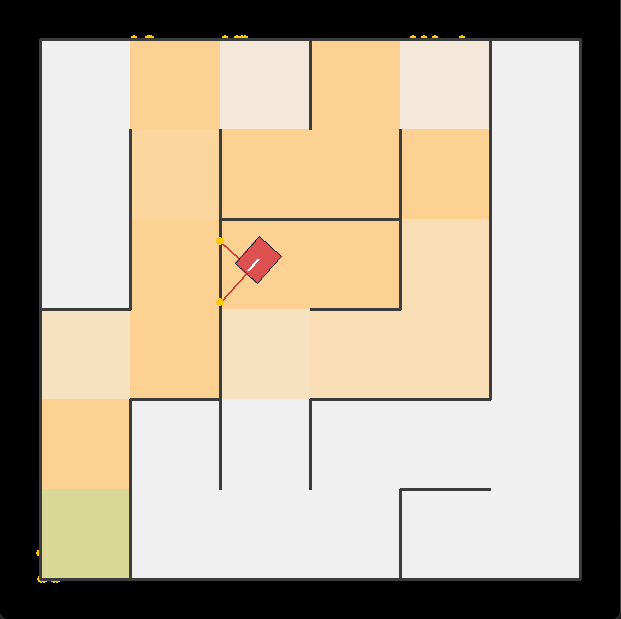

# 🤖 robo_gym

> A 2D Gymnasium-compatible environment for training reinforcement learning agents to navigate mazes — built for the **RoboCup Junior Maze Entry** competition.



---

## 🎯 What is this?

**robo_gym** lets you train RL agents on a configurable 2D differential-drive robot navigating procedurally generated mazes.
It is **not** a full physics engine — the simulation intentionally models a simplified 2D world: differential-drive kinematics, AABB wall collisions, and distance sensors.
The goal is to learn navigation policies (how to steer based on sensor input) that can later transfer to real hardware.

The environment follows the [Gymnasium](https://gymnasium.farama.org/) API, so any standard RL library works out of the box.

---

## ✨ Features

| | Feature | Details |
|---|---|---|
| 🏎️ | **Configurable robot platform** | Set chassis geometry (wheel base, body size, axle offset) and drivetrain parameters (max speed, turn drag, lateral slip noise) |
| 📡 | **Ultrasonic sensor model** | Ray-cast based; configurable position, orientation, range, baseline noise, angle-dependent noise, and spurious return rate |
| 🧱 | **2D maze world** | AABB + wall-segment collision detection with push-out response |
| 🎮 | **Gymnasium compatible** | Standard `reset()` / `step()` API — plug in Stable Baselines3, RLlib, or any other RL library |
| 🔧 | **Environment wrappers** | Sub-stepping, real-time sync, and render-cadence decoupling |
| 🗺️ | **Maze generation** | DFS and Prim's algorithms; JSON serialisation for reproducibility |
| 🖥️ | **PyGame visualiser** | Renders maze walls, robot body, trajectory, and sensor rays in real time |

---

## ⚙️ Requirements

- Python 3.13+
- [`uv`](https://github.com/astral-sh/uv) package manager

---

## 🚀 Installation

```bash
git clone https://github.com/Toboxos/robo_gym.git
cd robo_gym
uv venv
uv sync
```

---

## 🏁 Quick Start

```python
import gymnasium as gym
import robo_gym
from robo_gym.sim_core import (
    RobotConfig, ChassisConfig, DrivetrainConfig,
    UltrasonicSensorConfig, GaussianNoise,
)
from robo_gym.maze import Maze

# Load a pre-generated maze
maze = Maze.load_json("mazes/maze_6x6_dfs_seed42.maze.json")

# Configure the robot platform
robot = RobotConfig(
    chassis=ChassisConfig(wheel_base=0.15, body_width=0.13, body_length=0.18),
    drivetrain=DrivetrainConfig(
        max_speed=0.2,
        turn_drag=1.1,                          # simulates chain/track resistance
        lateral_slip=GaussianNoise(std=0.002),  # optional wheel slip noise
    ),
    sensors=(
        UltrasonicSensorConfig(
            name="front",
            position_offset=(0.09, 0.0),   # metres from centre of mass
            angle_offset=0.0,              # pointing forward
            max_range=1.5,
            sigma_base=0.005,              # baseline noise std (m)
            sigma_angle_factor=0.04,       # extra noise at oblique incidence
            spurious_rate=0.02,            # 2% chance of false max-range return
        ),
    ),
)

env = gym.make("robo_gym/MazeEnv-v0", maze=maze, robot=robot, render_mode="human")

obs, info = env.reset(seed=42)
for _ in range(1000):
    action = env.action_space.sample()   # your policy goes here
    obs, reward, terminated, truncated, info = env.step(action)
    if terminated or truncated:
        obs, info = env.reset()

env.close()
```

### ▶️ Run the PID wall-follower demo

```bash
uv run python examples/pid_controlled_robot.py
```

Loads a 6×6 maze, runs a PID controller using front and right ultrasonic sensors, and plots the robot trajectory alongside sensor readings over time.

---

## 🧩 Environment Details

### Action & Observation Spaces

| | Space | Description |
|---|---|---|
| **Action** | `Box([-1, 1]²)` | Normalised left and right motor power |
| **Observation** | `Box(n_sensors,)` | Distance readings in metres (one per mounted sensor) |

### 🔧 Environment Wrappers

```python
from robo_gym.env import SubStepWrapper, RenderWrapper, RealtimeWrapper

env = SubStepWrapper(env, n_substeps=10)  # run 10 physics ticks per agent step
env = RenderWrapper(env, fps=30)          # decouple render cadence from physics
env = RealtimeWrapper(env)                # throttle to wall-clock time
```

---

## 🏗️ Architecture

The simulation pipeline per step:

```
MazeEnv.step(action)
  ↓
PhysicsEngine.step()
  ├─ resolve_wheel_speeds()     — apply turn drag, slip noise, and speed clamping
  ├─ step_kinematics()          — ICC integration → new pose
  ├─ detect_collisions()        — AABB + wall segments
  └─ apply_collision_response() — push robot out of walls, inject angular impulse
  ↓
observation = [sensor.read() for sensor in sensors]
                  └─ MazeWorld.ray_cast() per sensor
```

### 📁 Module Overview

```
robo_gym/
├── env/         # Gymnasium MazeEnv + wrappers (SubStep, Render, Realtime)
├── sim_core/    # Kinematics, collision, sensor base class, ultrasonic model
├── maze/        # Maze data model, DFS/Prim's generation, JSON serialisation
└── ui/          # PyGame renderer
```

---

## 🗺️ Pre-generated Mazes

| File | Size | Algorithm |
|------|------|-----------|
| `maze_6x6_dfs_seed42.maze.json` | 6×6 | DFS |
| `maze_8x8_prims_seed7.maze.json` | 8×8 | Prim's |
| `maze_10x10_dfs_seed123.maze.json` | 10×10 | DFS |

Generate a custom maze:

```python
from robo_gym.maze import generate_dfs

maze = generate_dfs(width=10, height=10, seed=99)
maze.save_json("mazes/my_maze.maze.json")
```

---

## 🧪 Tests

```bash
uv run pytest
```

---

## 🤝 Contributing

- Type hints on all public functions and dataclasses
- One-liner docstring minimum on every public function
- No `print()` in library code — use the `logging` module
- Tests should cover behaviour, not structure

---

## 📄 License

This project is licensed under the **MIT License** — see [LICENSE](LICENSE) for details.

> **Why MIT?** It's simple and permissive: anyone can use, modify, and share this for research, education, or competition prep, with no strings attached.

---

## 🏆 Context

This simulator targets the [RoboCup Junior Maze Entry](https://junior.robocup.org/rcj-rescue-maze/) challenge.
The 2D environment intentionally covers a focused slice of the real problem: learning to steer a differential-drive robot through a maze using only distance sensor readings.
The aim is to train navigation policies offline and evaluate how well learned behaviours transfer to real hardware.
